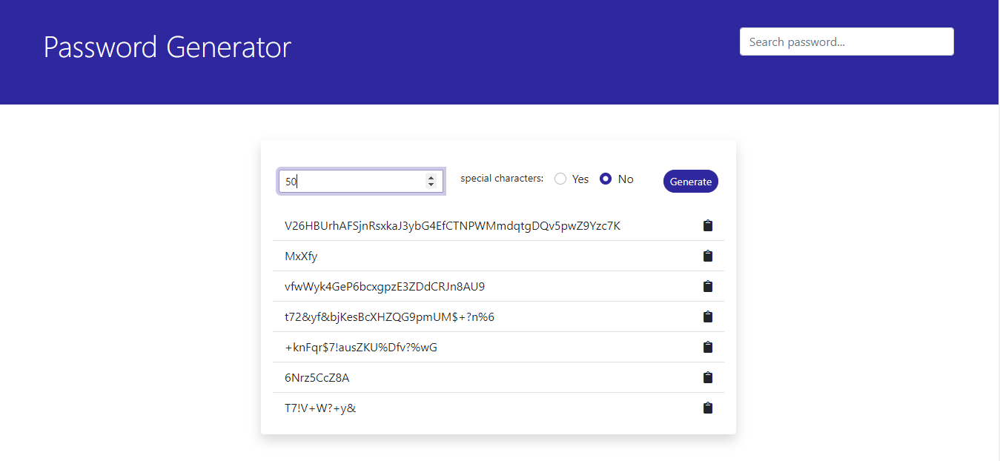

# Flask-API Based Password Generator App

## Motivation

The goal of this project is to create a user interface for consuming a random character generator [API](https://fierce-anchorage-76525.herokuapp.com) that I created using Flask.

## Screenshot

## URL

[Password Generator App](https://suspicious-galileo-c6e204.netlify.app/)

## Installation

Clone Repo

## Tech/framework used

1. HTML5
2. CSS3
3. Bootstrap 5
4. SASS
5. Netlify
6. JavaScript/jQuery
7. Local Storage
8. JSON

## Contributing

Pull requests are welcome. For major changes, please open an issue first to discuss what you would like to change.

## License

[MIT](https://choosealicense.com/licenses/mit/)
